# Conexión Php a Informix con docker
 
Este proyecto está basado en una actividad laboral 100% real ya que se requirió realizar una conexión a de base de datos con informix desde php. Para esto se tomó la decisión de usar pdo por lo que informix tiene una forma bastante sutil (**fea** 🤯 🤯 ) de crear un pdo_informix.so.
 
## Notas importante
 
Con este contenedor se pueden realizar conexiones a bases de datos de tipo informix y hasta este momento `(19-septiembre-2020)` funciona de forma correcta. Lamentablemente por cuestiones de tiempo se creó una imagen algo pesada`(monstruo)`, que espero poder mejorar si el tiempo me lo permite.
 
La imagen es pesa `1.33GB` 😱_ aproximadamente ya que se crea con una imagen de ubuntu18.04 y dentro de esa imagen se realizan todas las instalaciones requeridas:
 
1. Actualizaciones de ubuntu
2. Instalación de Apache
3. Instalación de php7.2
4. Instalación de diferentes módulos de php7.2
5. Instalación de CSDK-informix (Client sdk de informix)
6. Instalacion y creacion de pdo_informix.so

**Al parecer la mejor forma de realizar esta conexión es usando `Apache` ya que intentamos con `Nginx` y no lo logramos esto puede ser a un desconocimiento del uso de Nginx (perdón😥 😓).**

Si tienes alguna duda o mejora que quieras compartir no dudes en contactar.

## Paquetes para la instalación de pdo_informix.so
 
Para la generación del paquete se requieren los siguientes paquetes:

* [ibm.csdk.4.50.FC1.LNX.tar](https://drive.google.com/file/d/1prZ_MxgspKj26oYEAi2eXfamgJVAGecX/view?usp=sharing) Para este paquete toma en cuenta el apartado de abajo. 
* [PDO_INFORMIX-1.3.3.tgz](https://drive.google.com/file/d/1fW8D3eiJt1shjC5ka-cBZaQf9gUAbHn6/view?usp=sharing)

Los links son drive espero nunca se borren esos paquetes en caso de que eso pase los podras descargar de la página de [IBM](http://www-306.ibm.com/software/data/informix/tools/csdk/) 🧟  🧟‍♂️  🧟‍♀️.

### IBM CSDK

Lamentablemente el paquete `ibm.csdk.4.50.FC1.LNX.tar` pesa casi **200 MEGAS**, por este motivo si buscas en la carpeta **ibm** solo veras un **info.txt** que te explica lo mismo que aquí 🤪.

Usa el link de descarga del paquete de **ibm.csdk.4.50.FC1.LNX.tar**, en cuanto descargues coloca ese paquete en la carpeta **ibm**. Recuerda no cambiar el nombre o la extensión ya que la instalación se hace con ese mismo archivo.

[ibm.csdk.4.50.FC1.LNX.tar](https://drive.google.com/file/d/1prZ_MxgspKj26oYEAi2eXfamgJVAGecX/view?usp=sharing)

# Levantando el docker

En tu terminal dirígete a la raíz de este proyecto donde debes ver el archivo **Dockerfile** y **docker-compose.yml**, si no estás en esa carpeta ya te pasaste y debes dar vuelta en el siguiente retorno 😅.

Si ya descargaste e **csdk** ya solo tienes que iniciar la creación de la imagen:

`docker-compose up -d`

El proceso de la creación es muy tardado si gustas ve por un café ☕️ y convive con las personas que dicen ser tu familia 👨‍👩‍👧‍👦, espero que te caigan bien.

Si todo resulta correcto verás una respuesta como esta:

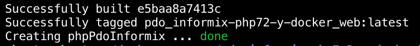

## Donde demonios 👹 👺 se levantó 

Si revisas el **docker-compose.yml** verás en la parte final un apartado llamado **ports** donde le decimos a docker que las personas normales acceden desde el puerto **9001** y los redirige al puerto **80** de docker.

Tambien puedes ver esto si ejecutas un:

`docker ps`

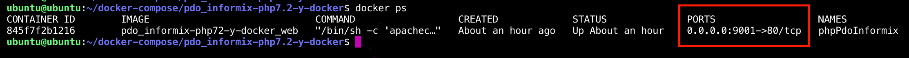

## Cómo acceder al proyecto

En mi caso particular trabajo con una máquina virtual de virtualbox que está en otra máquina. Lejos de mi pero en la misma red. 

Por lo que tengo que configurar el reenvío de puertos como NAT en la máquina virtual.

Si estás ejecutando el docker desde tu misma máquina seguramente tendrías que acceder desde tu misma **tu_ip:9001** o **localhost:9001**.

En caso de que también uses una maquina virtual te dejo unas imagenes de como tengo configurada mi maquina virtual.

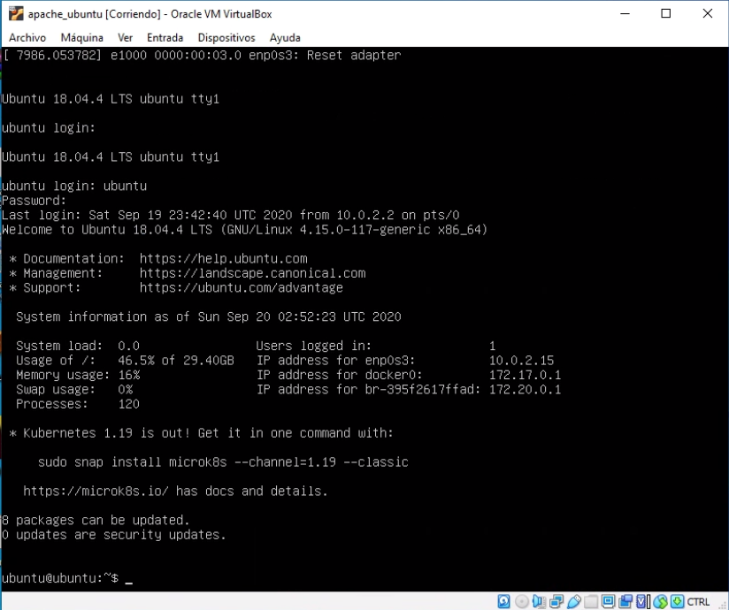

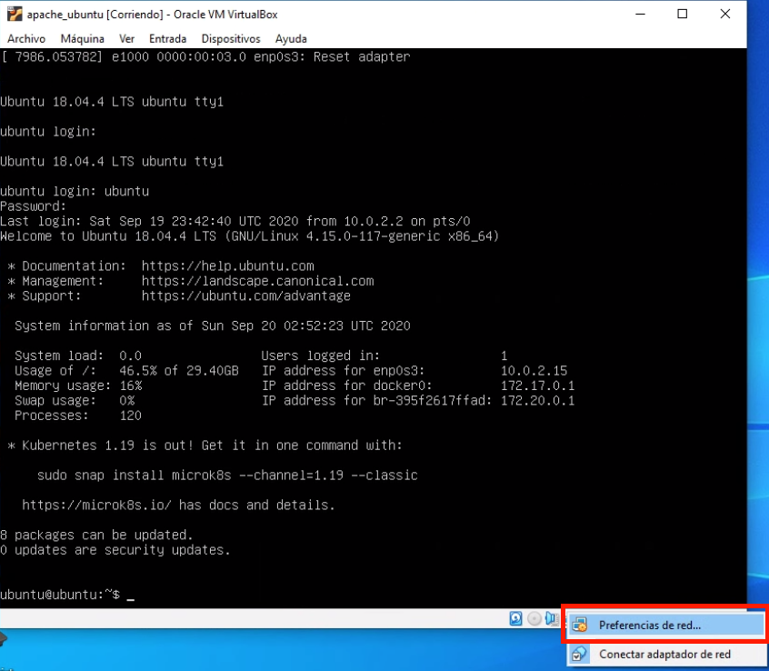

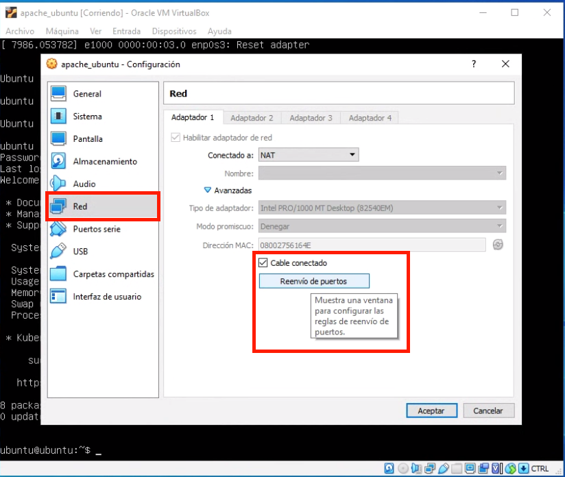

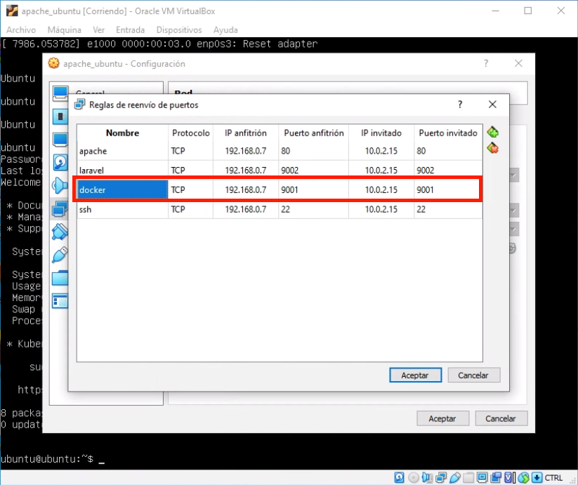

Por lo tanto para acceder lo hago con esta ruta en mi navegador:

[http://192.168.0.7:9001/](http://192.168.0.7:9001/)

Al acceder vere lo siguiente:

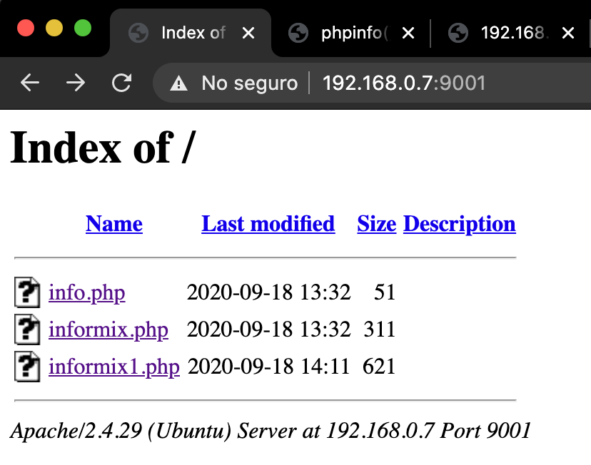

Hay 3 archivos:

1. **info.php** (Solo es la pagina de informacion de php para ver sus paquetes)
2. **informix.php** (Solo es un ejemplo de conexión si la conexión es correcta solo lo dice)
3. **informix1.php** (Es una consulta que imprime el objeto de la consulta)

Por lógica tienes que cambiar los datos de conexión ya que en el repositorio solo dejare textos de ejemplo.

## informix.php

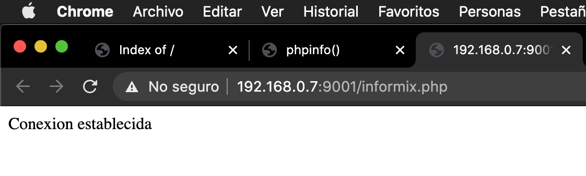

## Que hay en el info.php

En el info.php solo debes buscar todo lo que dice informix que es lo que básicamente debe cumplir para poder realizar conexiones.

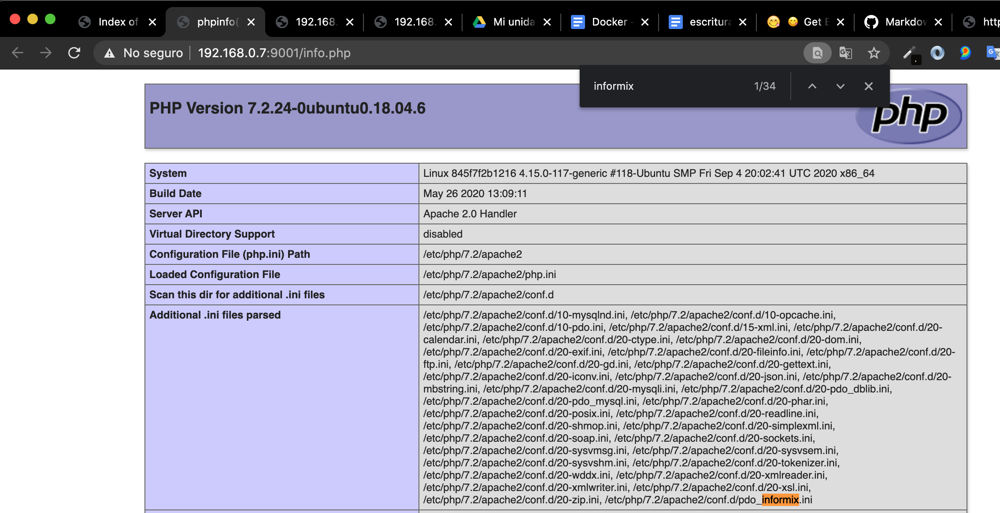

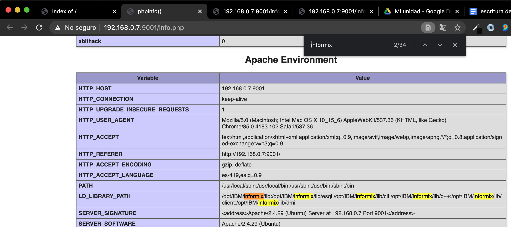

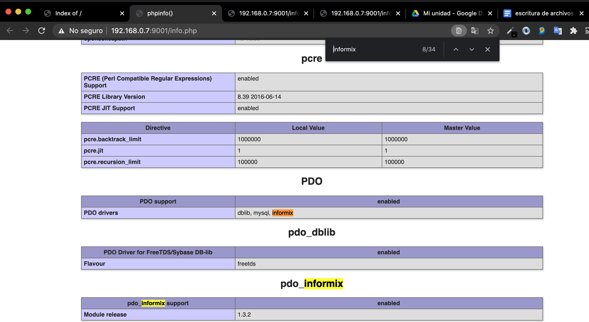

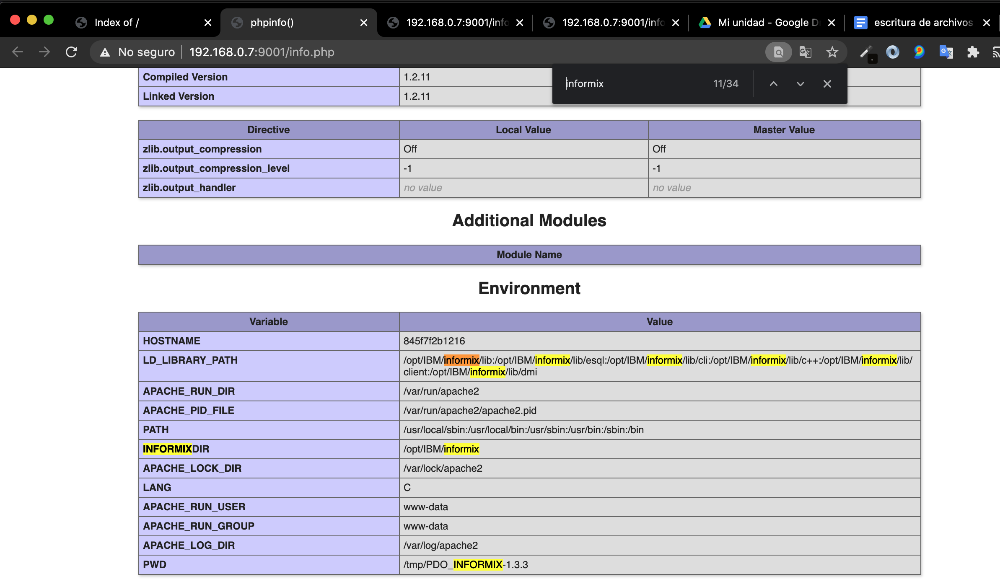

# Adios

Espero que todo esto te ayude y de verdad espero actualizar este repo.

Larga vida y prosperidad 🖖 🙂

